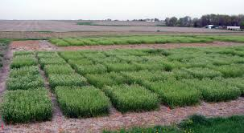
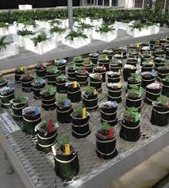
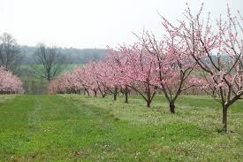

## Layout of different types of experiments
 
 
 

--- .class #id


## Purpose of project

1. In research the randomizations of experimental treatments is extremely important for 
    statistical analysis.  Whether the experimental units are plots in a field, trees in an orchard
    or plants on a bench in a greenhouse/growth chambe, It is critical to assign the treatments at
    random.
2.  The shape of the fields or orchards are variable.  Consequently, the app needs the 
    flexibality to handle variable field size, number of rows and columns.
3. There are several ways to randomize experimental units.  A second step is needed to assign
    treatments to randomized eperimental units. This app combines both the randomization of 
    experimental units and assignment of treatments.

---

   
## How the project was implemented
1. Choose the matrix as the best data structure.
2. Chose algorthim for randomizing experimental units- "sample"" function. 
3. Create vector with randomized experimental units.
4. Create matrix.
  +  First column with treatments numbers from 1 to with a treatment number for each replicate
  +  Second column contains 1 thru total number of experimental units.
5. Conversion of randomizes experimental units to randomized treatment number.
6. The app does not deal with irregularly shaped layouts.  An additional step would be required
to adjust the assignment of randomized treatments to the irregulary shape.

--- .class #id

## Output of shiny app to randomized treatment
1. Number of columns:    3
2. Number of rows:       5
3. Number of Treatments: 5
4. Number of Replicates: 3


```
##      [,1] [,2] [,3]
## [1,]    2    2    5
## [2,]    2    4    1
## [3,]    5    3    5
## [4,]    3    3    4
## [5,]    4    1    1
```
---


